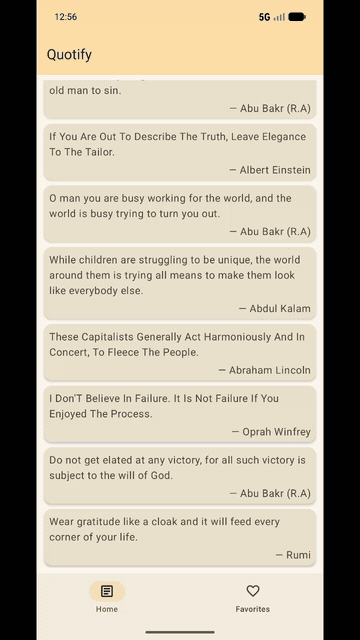
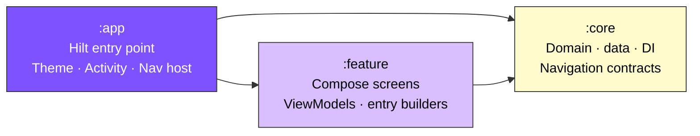
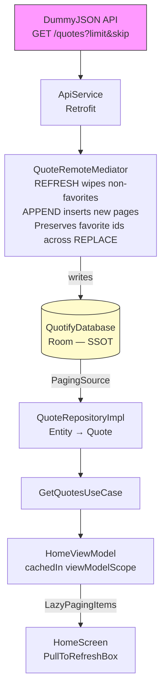
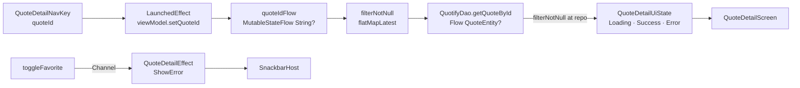

# Quotify

> A small Android app built to demonstrate **production-grade Clean Architecture**, **multi-module Gradle**, **offline-first data flow**, and **modern Jetpack Compose patterns**.

[]()
[]()
[]()
[]()
[]()

---

## Demo



*Browse paginated quotes → open a detail → toggle favorite → switch to Favorites tab → enable airplane mode → cached quotes still load with an offline banner.*

---

## Why Quotify exists

Most "Android sample apps" are either a single Activity demonstrating one feature, or so over-engineered that the patterns are buried in framework noise. Quotify is sized to fit on one screen of explanation while still applying the same constraints a production codebase has to respect:

- **No mutable state escapes the ViewModel** — UI is pure of business logic.
- **Room is the single source of truth** — the UI never reads the network directly; the `RemoteMediator` is the only writer.
- **Structured concurrency is not optional** — `CancellationException` is rethrown explicitly at every catch site.
- **Side effects vs state are separated** — one-shot events (snackbars) flow through a `Channel`, persistent state through `StateFlow`.
- **Recomposition scope is minimized** — back-stack reads go through `derivedStateOf`, screens are split so the top bar doesn't recompose on list updates.

---

## Tech stack

| Layer | Choice | Notes |
|---|---|---|
| Language | **Kotlin 2.1.0** | `WhenGuards` enabled for `is X if condition ->` branches in paging loadState handling |
| UI | **Jetpack Compose** (BOM 2026.04) + Material 3 | Full color scheme generated from a seed color via Material Theme Builder |
| Async | **Coroutines + Flow** | `StateFlow` + `WhileSubscribed(5s)` for UI state; `Channel` for one-shot effects |
| DI | **Hilt 2.53** | 4 modules in `:core/di/` — Network, Database, Repository, Connectivity |
| Networking | **Retrofit 3 + OkHttp 5** | `BuildConfig.DEBUG`-gated body logging, 15s timeouts on all dispatchers |
| Persistence | **Room 2.8.4** | DAO exposes both `PagingSource` and `Flow<List<…>>` |
| Pagination | **Paging 3** + `RemoteMediator` | Honors `state.config.initialLoadSize` on REFRESH to avoid 3× round-trips |
| Navigation | **Navigation 3** (`androidx.navigation3:*`) | Type-safe `NavKey`s with `kotlinx.serialization` polymorphic registration |
| Connectivity | `ConnectivityManager` + `callbackFlow` | Tracks a **set** of validated networks so losing Wi-Fi with cellular up doesn't false-report offline |
| Testing | **JUnit 4 + MockK + Turbine + paging-testing** | `StandardTestDispatcher` via a reusable `MainDispatcherRule` |
| Lint | **ktlint 1.5.0 + compose-rules** | 120-char lines, Compose lambda-naming conventions enforced |

---

## Architecture

### Module graph



`:core` is the leaf — it never depends on Compose, never on `:feature`, never on `:app`. This is checked by the dependency graph, not just by convention.

### Data flow (paging path)



**Invariants worth knowing before editing this path:**

- The `RemoteMediator` is the **only** writer to Room. The UI never reads the network directly.
- `LoadType.PREPEND` returns `endOfPaginationReached = true` immediately — the API doesn't support it.
- `LoadType.APPEND` skip is `state.pages.sumOf { it.data.size }` (items loaded, not page count).
- `LoadType.REFRESH` requests `state.config.initialLoadSize` (3× pageSize by default).
- Favorite preservation only runs in the REFRESH branch — APPEND brings brand-new ids where the dance is wasted work.
- `CancellationException` is rethrown at every catch site so structured concurrency isn't silently swallowed.

### Detail screen (single-item path)



- The detail VM uses **`filterNotNull → flatMapLatest → stateIn`** so re-entering the screen with the same id doesn't restart the Room query, and a new id structurally cancels the previous inner Flow.
- Errors that don't belong in the persistent state (failed favorite toggle while online) go through a **`Channel<QuoteDetailEffect>`** so they aren't replayed on re-collection.

### Favorites screen (reactive list)

The favorites screen subscribes to `quotifyDao.observeFavoriteQuotes()` (a `Flow<List<QuoteEntity>>`). Toggling a favorite from anywhere in the app — detail screen, future widgets, push handlers — updates the favorites list automatically. There is **no manual refresh function**.

---

## Project structure

```
:app
├── app/                              # Hilt entry, MainActivity, theme, app shell
├── app/navigation/                   # AppNavigator (impl), NavHost, polymorphic serializers
└── theme/                            # Material 3 color scheme + typography

:core
├── common/                           # DomainResult<T> wrapper
├── data/
│   ├── localDatabase/                # Room: QuotifyDao, QuotifyDatabase, QuoteEntity
│   ├── network/                      # Retrofit ApiService, ConnectivityManager flow
│   ├── paging/                       # QuoteRemoteMediator, PagingConstants
│   ├── mapper/                       # DTO ↔ Entity ↔ Domain
│   └── repository/                   # QuoteRepositoryImpl
├── domain/
│   ├── model/                        # Quote (UI-framework-free)
│   ├── repository/                   # QuoteRepository (interface)
│   ├── usecase/                      # Get/Toggle/Observe use cases
│   └── connectivity/                 # NetworkMonitor (interface)
├── di/                               # Network, Database, Repository, Connectivity modules
└── navigation/                       # Navigator interface, LocalNavigator, QuotifyNavKey

:feature
├── home/                             # HomeScreen + VM + entry builder + NavKeys
├── favorites/                        # FavoritesScreen + VM
└── quotedetails/                     # QuoteDetailScreen + VM + entry builder + NavKey
```

> **Namespace quirk:** Android `namespace` is `com.example.quotify[.core|.feature]` (historical), but Kotlin packages are `com.quotify.*`. Don't "fix" without coordinating — it affects BuildConfig imports and generated code.

---

## Build & run

JDK 17 required (configured via `jvmToolchain(17)`).

```bash
./gradlew assembleDebug              # Build debug APK
./gradlew installDebug               # Install on connected device/emulator
./gradlew assembleRelease            # Release APK

./gradlew test                       # All unit tests
./gradlew :core:test                 # Just core
./gradlew :feature:testDebugUnitTest --tests "com.quotify.feature.favorites.FavoritesViewModelTest"

./gradlew ktlintCheck                # Lint
./gradlew ktlintFormat               # Auto-fix
```

If Hilt or Room generated code gets out of sync after changes:
```bash
./gradlew clean build --rerun-tasks
```

---

## What's intentionally NOT in here

To stop "more is better" creep, these are deliberate scope decisions, not oversights:

- **No `feature/auth`, `feature/profile`, or sign-in flow.** No user model means no per-user favorites; the app is single-user, on-device.
- **No paging-aware favorites screen.** Favorites are bounded — a `LazyColumn` over a `List<Quote>` is correct here.
- **No kotlinx.serialization for DTOs.** Gson works; swapping would touch every DTO without changing behavior. Noted as future work.
- **No instrumented UI tests yet.** Compose UI tests for the loadState branching are the next addition.
- **No Crashlytics / analytics.** Would be wired in a real production setup; left out so the dependency graph stays readable.

---

## License

MIT — see [LICENSE](LICENSE).
